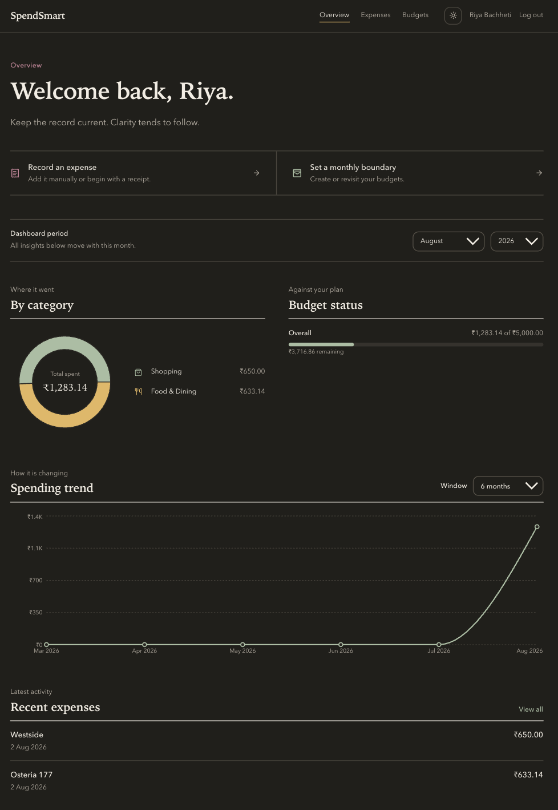
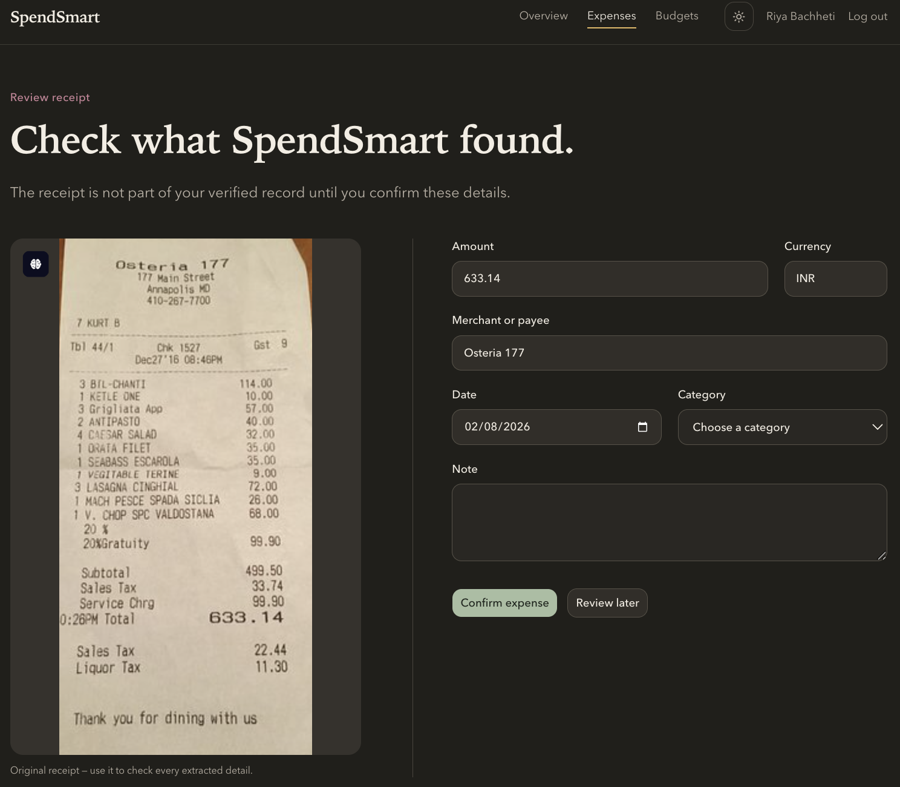

# SpendSmart

SpendSmart is a full-stack expense tracker for recording everyday spending,
reviewing scanned receipts, setting monthly budgets, and understanding spending
patterns. Receipt processing runs asynchronously, and extracted values must be
reviewed before they become verified expenses.

## Preview

### Dashboard



### Receipt OCR review



### Landing page


## Features

- Secure registration and login with short-lived access tokens and rotating
  HttpOnly refresh cookies
- Expense creation, editing, filtering, pagination, and deletion
- Shared default categories and user-defined custom categories
- Overall and category-specific monthly budgets
- Category breakdowns, spending trends, and budget-versus-actual analytics
- Receipt upload and OCR processing with Redis, Celery, and Tesseract
- Responsive interface with accessible charts and light/dark themes

## Technology

| Area | Tools |
| --- | --- |
| Frontend | React, TypeScript, Vite, Tailwind CSS, TanStack Query, Recharts |
| Backend | FastAPI, Pydantic, SQLAlchemy, Alembic |
| Data | PostgreSQL, Redis |
| Receipt processing | Celery, Tesseract, Pillow, Cloudinary |
| Testing | Pytest, Vitest, Testing Library, MSW, Ruff, Oxlint |

## Local setup

### Requirements

- Python 3.13
- Node.js 20 or newer
- PostgreSQL
- Redis
- Tesseract OCR
- A Cloudinary account for receipt uploads

### Backend

```bash
cd spendsmart-backend
python3 -m venv .venv
source .venv/bin/activate
pip install -r requirements-dev.txt
cp .env.example .env
```

Create the PostgreSQL database, then update `.env` with its connection string,
a secret key, and your Cloudinary settings. Apply the migrations and seed the
default categories:

```bash
alembic upgrade head
python -m scripts.seed_categories
```

Start the API:

```bash
python -m uvicorn app.main:app --reload
```

For receipt processing, run Redis and start a Celery worker in another terminal:

```bash
.venv/bin/python -m celery -A app.core.celery_app.celery_app worker --pool=solo --loglevel=INFO
```

The API is available at `http://localhost:8000`, with interactive documentation
at `http://localhost:8000/docs`.

### Frontend

```bash
cd spendsmart-frontend
npm ci
cp .env.example .env
npm run dev
```

Open `http://localhost:5173`.

## Tests and checks

Backend:

```bash
cd spendsmart-backend
.venv/bin/python -m pytest
.venv/bin/python -m ruff check app tests scripts
```

Frontend:

```bash
cd spendsmart-frontend
npm test
npm run lint
npm run build
```

The backend tests use an isolated SQLite database and do not connect to the
development database.

## Known limitations

- OCR results depend on receipt layout and image quality, so every scanned
  receipt requires user review.
- Budget-status analytics currently use INR only.
- Receipt processing requires Cloudinary, Redis, Celery, and Tesseract to be
  configured separately.
- The frontend is a client-rendered application and does not provide offline
  support or bank-account synchronization.

The current React Router advisory assessment and compensating controls are
documented in
[spendsmart-frontend/docs/SECURITY_EXCEPTIONS.md](spendsmart-frontend/docs/SECURITY_EXCEPTIONS.md).
